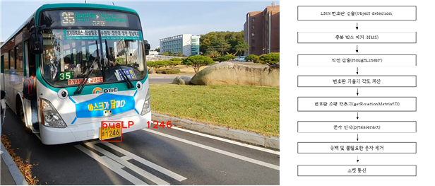
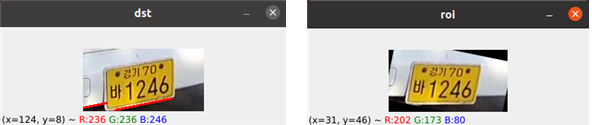

# 시각장애인 버스 이용편의 개선 시스템

## (Convenience system for using bus for the visually impaired)

### 작품명 : Visual Station

---


  시각장애인에 버스 이용 실태를 분석하여 문제점을 찾고 버스편의를 개선하는 프로젝트로 신호등에 있는 버튼을 버스정류장에 적용하여 탑승 버스를 등록받고 버스기사에게 LED 전광판으로 정차를 대신 유도해주며, 버스가 집입할 때 시각장애이인의 눈을 대신하여 버스를 영상을 식별하고 음성으로 안내하는 프로젝트.

### 기존 문제점

1. 버스가 몇 정거장 전에 있고 곧 진입함을 알 순 있지만, 정작 현재 진입하는 버스 번호를 시각장애인은 알 수 없고, 여러대 동시 진입할 때 버스를 구별할 수 업음
2. 탑승할 때 버스입구를 찾을 수 없어 타인에 도움을 필요로하고, 차도에서 헤매는 위험 존재
3. 탑승하려는 버스가 진입해도 정차를 요청하기 어려워 지나치는 경우 빈번히 발생

### 개발 배경 이슈

1.  시각장애인 버스 이용 개선 국민 청원 [https://www1.president.go.kr/petitions/583770](https://www1.president.go.kr/petitions/583770)
2. 시각장애인 버스 이용 실태 설문 조사 [http://www.kbufac.or.kr/Board/News/Detail?ContentSeq=1557&Page=30](http://www.kbufac.or.kr/Board/News/Detail?ContentSeq=1557&Page=30)
3. [소수의견]버스 탄 시각장애인봤나요?... “타고 내리는게 전쟁”
[https://imnews.imbc.com/replay/2019/nwdesk/article/5644605_28802.html](https://imnews.imbc.com/replay/2019/nwdesk/article/5644605_28802.html)

---

## 프로젝트 내용


### 영상인식 정류장 진입 버스 안내

시각장애인의 눈을 대신하여 버스를 식별하여 음성으로 안내하는 기능으로 버스 정면을 촬영하여 버스의 차량 번호판을 영상에서 검출한 후 공공데이터 포털에서 제공하는 도착 버스 번호판 정보와 대조하여 버스를 식별합니다. 식별된 버스는 음성으로 안내합니다.

### LED 버스 정차 유도

시각장애인을 대신하여 버스에 정차를 유도하는 기능으로 버튼과 로터리엔코더를 통해 버스를 등록받고 공공데이터 포털 버스 정보에서 등록된 버스가 진입으로 바뀔 때 LED 전광판에 버스 번호를 표출하여 버스기사에게 정차를 유도합니다.

---

## 1. 버스 번호판인식(서브프로세서)

### SubProcess/

- RaspberryPi 4 (OS : Raspbian)
- C++
- OpenCV 4.3.0 / Tesseract-OCR
- TCP Socket Commuication (Wifi)

```powershell
# OpenCV
  # cmake를 이용한 설치 필요 4.3.0 (생략)
# Tesseract-OCR
sudo apt-get install tesseract-ocr
sudo apt-get install tesseract-ocr-eng
sudo apt-get install tesseract-ocr-kor
sudo apt-get install tesseract-ocr-script-hang

# Compile
g++ SubMain.cpp -o substart $(pkg-config opencv4 tesseract --libs --cflags)
# Start SubProcess
./substart

```

- 파라메타 수정 - dat 파일

### 1. 번호판 검출 OpenCV



번호판 검출은 Sub RaspberryPi에 연결된 웹캠으로 촬영된 버스 정면 영상에서 번호판 위치 및 크기 비율 특성을 이용하여 OpenCV 기반 영상처리로 검출



[http://law.go.kr/행정규칙/자동차 등록번호판 등의 기준에 관한 고](http://law.go.kr/%ED%96%89%EC%A0%95%EA%B7%9C%EC%B9%99/%EC%9E%90%EB%8F%99%EC%B0%A8%20%EB%93%B1%EB%A1%9D%EB%B2%88%ED%98%B8%ED%8C%90%20%EB%93%B1%EC%9D%98%20%EA%B8%B0%EC%A4%80%EC%97%90%20%EA%B4%80%ED%95%9C%20%EA%B3%A0%EC%8B%9C)

[[별표 6] 자동차 운수 사업용 대형 등록 번호판(440-220)](https://law.go.kr/LSW//admRulInfoP.do?chrClsCd=010201&admRulSeq=2100000188560#AJAX)

자동차 운수 사업용 대형 등록 번호판(노란색) 규칙에  따라 번호판의 글자간 위치 및 크기 비율 조건으로 번호판 글자들이 줄 단위로 그룹화 한 후 2줄에 대한 그룹화를 진행하여 번호판을 검출


- 전처리→ 윤곽검출→위치, 크기비율특성→1줄 그룹화→2줄그룹화 →OCR

### 2. 글자검출 Tesseract-OCR


 번호판 검출로 얻은 이미지에 번호판영역은 Tesseract-OCR 입력으로 전달

 검출된 번호판 글자는 정확도 개선을 위해 불필요한 글자 및 공백을 제거

 최종 검출된 문자는 공공데이터 포털에서 제공하는 정류장 버스도착정보(XML) 데이터와 비교

- 현재 DNN을 이용한 방법으로 번호판 검출을 개선 중

    [https://github.com/ewooooo/BusLicensePlate_Detection](https://github.com/ewooooo/BusLicensePlate_Detection)

    [https://lab.hanium.or.kr/20_pf008/buslicenseplate_detection](https://lab.hanium.or.kr/20_pf008/buslicenseplate_detection)

---

## 2. 메인프로세서

(음성안내, LED정차유도, 버스식별_번호판대조)

### MainProcess/

- RaspberryPi 4 (OS : Raspbian)
- python 3.8
- TCP Socket Commuication (LAN)
- Multi Thread
- 모듈화(각 모듈 개별 동작 가능, 기능별 분리) _baseModule

```powershell
# TTS 및 BUS info 인증키 추가 ./MainProcess/keyData.py
# pygame 설치 필요
# LED 라이브설치 필요
# Start System
python3 ./MainProcess/Main.py
```

```python
#./MainProcess/ 디렉토리에 keyData.py 생성
TTS_client_id= '****************'
TTS_client_secret= '************************'
stationNumber = '203000165' #정류장 ID
serviceKey = '****************'
updateCycle = 10
HOST = '127.0.0.1'
PORT = 12345
```

### 1) 버튼 & 로터리엔코더 (버스입력)


- 기존 신호등 음향신호기 버튼과 동일하며, 노란색 손잡이 부분 회전

    버튼 [HX16-B4] : [https://www.devicemart.co.kr/goods/view?no=1325013](https://www.devicemart.co.kr/goods/view?no=1325013)

    로터리엔코더 20펄스 D컷 샤프트 15mm : [https://www.devicemart.co.kr/goods/view?no=12501931](https://www.devicemart.co.kr/goods/view?no=12501931)

    깊은홈 [6005ZZ] : [https://www.devicemart.co.kr/goods/view?no=1273587](https://www.devicemart.co.kr/goods/view?no=1273587)

    슬립링 [SZH-SLI004]: [https://www.devicemart.co.kr/goods/view?no=12511672](https://www.devicemart.co.kr/goods/view?no=12511672)

**baseModule/ButtonModule.py**  

- 버튼 및 로터리엔코더 GPIO 입력제어 코드 모듈
- 버튼 - 짧게 눌림/ 길게 눌림 && 로터리엔코더 - 왼쪽/오른쪽 회전
- wakeUpTest() - 버튼에 입력을 반복 체크하여 눌리면 True 반환

**myButton.py**

- ButtonModule.py  baseButton class를 상속받아 Main.py에서 checkButton()이 쓰레드로 작동
- 짤게눌림 - 탑승 버스 등록 / 길게 눌림 - 등록버스취소 && 로터리엔코더 회전 - 버스 선택

버튼 - 기계적 오류로 인한 눌림을 방지하기위해 최소 눌림 시간 적용

로터리엔코더 - 상태 변화 직후 일정시간 상태 누적하여 회전 방향 구분

### 2) 버스정보

- 공공데이터 포털에서 제공하는 정류장 도착정보 API를 사용 [XML]
- 버스노선 조회 서비스 : [https://www.data.go.kr/data/15058051/openapi.do](https://www.data.go.kr/data/15058051/openapi.do)
- 버스 도착 정보 조회 서비스 : [https://www.data.go.kr/data/15058837/openapi.do](https://www.data.go.kr/data/15058837/openapi.do)

**baseModule/BusModule.py**

```powershell
import xml.etree.ElementTree as ET
# https://docs.python.org/3/library/xml.etree.elementtree.html
```

REST를 이용하여 데이터를 받아 XML 파싱 수행, XML 파싱은 위 라이브러리 사용

- class Bus 단위로 busDict 딕셔너리에 저장 및 업데이트
- 업데이트 시 새로운 버스 발결되면 addBusAction() 수행

**Bus.py**

- addBusAction()으로 새로운 버스 TTS 음성 데이터 생성
- Main.py에서 loopUpdate() 쓰레드로 실행됨
- 현재 정류장 상태 및 버스 차량 번호 대조 기능 제공
- keyData.py 정류자ID 및 인증키 설정

### 3) 음성안내(TTS & 재생)

```jsx
# 음성안내 mp3(or WAV) 재생 라이브러리
pip install pygame
```

1. TTS 음성파일 생성 

    Naver CLOVA TTS(CSS) 서비스 API 이용

2. 음성파일 재생 (mp3 or wav)

    pygame 모듈 -  pygame.mixer 사용

    [https://www.pygame.org/docs/ref/mixer.html](https://www.pygame.org/docs/ref/mixer.html)\

    배경음으로 재생 → mp3 / 효과음으로 재생 → wav or ogg

**baseModule/TTSModule.py**

- TTS 음성파일 생성 기능 제공(wav)
- 음성파일 재생 → 여러 음성 파일 문장 재생 기능 제공
- 사운드 채널 2개 사용하여 음성 동시 재생 및 볼륨 제어 가능
- 음성 재생 시 쓰레드 생성하여 파일 재생(이전 파일 재생 중일 경우 중단 후 재생)

**busPlayList.py**

- baseModule/TTSModule.py TTS 클래스 상속 받아 사용
- init() : 필수 구문 및 필수 문장 음성파일 생성
- 메인에서 필요 음성 playVoice()를 이용하여 재생

### 4) LED 전광판(버스 정차유도)


- Adafruit 64x32 RGB LED matrix panel 사용
- 버스번호와 장애인 기호 표시
- 핀 배열


```powershell
# Adafruit 64x32 RGB LED matrix panel 라이브러리 설치
git clone https://github.com/hzeller/rpi-rgb-led-matrix/

# 컴파일
cd rpi-rgb-led-matrix
make

# 사운드 비활성화
cat <<EOF | sudo tee /etc/modprobe.d/blacklist-rgb-matrix.conf
blacklist snd_bcm2835
EOF
sudo update-initramfs -u

# 라이브러리에 대한 python 바인딩
cd bindings/python/
sudo apt-get update && sudo apt-get install python3-dev python3-pillow -y
make build-python PYTHON=$(which python3)
sudo make install-python PYTHON=$(which python3)
```

**baseModule/LEDModult.py**

- Adafruit 64x32 RGB 제어 코드
- SET_LED(string)을 이용하여 LED Display
- OFF_LED()를 이용하여 LED Display 중지

**LED.py**

- Main.py → Control 클래스에서 호출하도록 구현
- 여러 버스 번갈아 재생은 Control 클래스에서 제어

### 5) 버스 대조(소켓통신)

**baseModule/SocketMoudule.py**

- 소켓통신 클라이언트 기능 구현 (Send_Recv)
- C 버퍼 오류로 인한 자리수 프로토콜 적용

**my_socket.py**

- loopSocket() : Main.py에서 쓰레드로 실행되어 통신시작
- 받은 정보를 Main.py Control 클래스를 이용하여 대조 후 음성안내 실행.

### 6) 기타 메인 프로세스 사항

- 메인 루프시스템은 평시 대기모드 상태에서 버튼으로 wakeup됨
- wakeup 시 각 쓰레드(총4) 생성 - 멀티쓰레딩
- 각 모듈 및 기능 간에 상호제어는 class Control을 통해서 전달 및 호출하여 제어하는 구조

---

## 기타 참고문헌

[1] Dong-Kyung Kim, "Development of Wireless License Plate Region
Extraction Module Based on Raspberry Pi", Journal of Korea Multimedia Society Vol. 18, No.
10, October 2015(pp. 1172-1179)

---

## ReleseNote

**v1.0** : 2020.06 초기 모델

**v1.1** : 2020.10 issues 및 추가 요구명세 수정

- #1 : 음성안내 pygame mp3 동시 실행 (버스 진입안내와 버스 선택 안내음성 동시 재생)
- #2 : 버스 입력 방법 수정 - 버튼 및 로터리 엔코더 (로터리엔코더-버스선택, 버튼-등록/취소)
- #4 : 도착정보 음성 안내 수정 (버스 도착정보 음성안내 지원안함, 필수적 음성안내만 제공)
- #5 : 버스 진입 및 정차 여부 안내 시점 수정 (버스 진입 시 조건 상관 없이 영상 판단 후 음성안내)
- #6 : v1.0.0 코드 리팩토링 (baseModule 및 프로젝트 Module 분리)

**v1.2** : 2020.10 LED

- #3 : LED 64x32 매트릭스 교체 (기존 64x16)
- #10 : 필수폴더 및 보안파일 등록(MainProcess/sound 폴더생성, 보안파일 등록안함 readme 기재)

---

## Developer:

남은우(경기대학교)    201512285@kyonggi.ac.kr

- Main 알고리즘, 멀티 쓰레드, Socket, 모듈화, 버튼&로터리엔코더 모듈 개발, 번호판인식 알고리즘(OpenCV), 버튼 구조 설계(3D 프린팅), 음성동시재생

이재빈(경기대학교)    [leejb8777@gmail.com](mailto:leejb8777@gmail.com)

- 버스정보 모듈 개발, Tesseract-OCR, 라즈비안 개발환경 구축(OpenCV, Tesseract-OCR), 전체 외관 설계, 테스트 시나리오, yolo DNN(진행중)

이경신(경기대학교)    [amablove1126@naver.com](mailto:amablove1126@naver.com)

- LED 모듈 개발, Socket, 번호판인식 알고리즘(OpenCV), 번호판 Dataset 생성(OpenCV)(진행중)

서유빈(경기대학교)    dbqls0246@gmail.com

- TTS(음성 생성&재생) 모듈 개발, Tesseract-OCR, 글자필터링, python-c 바인딩, yolo DNN(진행중)

---

## Clone Git

**github**

- Main : [https://github.com/ewooooo/SmartBusStop](https://github.com/ewooooo/SmartBusStop)
- Sub(DNN) : [https://github.com/ewooooo/BusLicensePlate_Detection](https://github.com/ewooooo/BusLicensePlate_Detection)

**gitlab:**

- Main : [https://lab.hanium.or.kr/20_pf008/main](https://lab.hanium.or.kr/20_pf008/main)
- Sub(DNN) : [https://lab.hanium.or.kr/20_pf008/buslicenseplate_detection](https://lab.hanium.or.kr/20_pf008/buslicenseplate_detection)

## Youtube

url.